## 📷 Proyek Deteksi Objek dengan Edge Impulse & ESP32-CAM
Proyek ini bertujuan untuk mengembangkan sistem deteksi objek berbasis machine learning yang diterapkan pada perangkat ESP32-CAM menggunakan platform Edge Impulse. Sistem ini akan mampu mengidentifikasi objek dalam gambar secara efisien meskipun dengan perangkat keras berdaya rendah.

## 🚀 Tentang Proyek
Proyek ini bertujuan untuk mengembangkan sistem deteksi objek yang dapat mengenali dua objek utama dalam arena perlombaan KRSRI 2024, yaitu korban dan dummy. Menggunakan platform Edge Impulse untuk melatih model machine learning dan perangkat ESP32-CAM, sistem ini diharapkan dapat memberikan solusi deteksi objek yang cepat dan akurat dalam kondisi lapangan yang dinamis. Tantangan utama dalam proyek ini adalah mengidentifikasi kedua objek tersebut secara efisien, mengingat keterbatasan sumber daya pada perangkat keras yang digunakan, serta variabilitas kondisi pencahayaan dan posisi objek di arena perlombaan.

Apa yang dapat dilakukan?
- ✅ Deteksi Objek Korban dan Dummy.
- ✅ Penggunaan Platform Edge Impulse.

## 🛠️ Fitur Utama
- Deteksi Objek Akurat dengan Machine Learning
- Integrasi dengan ESP32-CAM untuk Deteksi Real-Time
- Optimasi Perangkat Keras Berdaya Rendah

## 📋 Prasyarat
**Perangkat Keras**
1. ESP32-CAM
2. Kabel jumper (Opsional - Sesuai versi ESP32-CAM)
3. Sumber Daya Listrik (baterai atau kabel USB).

**Perangkat Lunak**
1. Akun Edge Impulse – [Daftar di sini](https://www.edgeimpulse.com)
2. Arduino IDE 1.8.19.
3. Board ESP32 2.0.4.

## 📖 Panduan Penggunaan
1️⃣ **Pelatihan Model**
Pelatihan model dilakukan menggunakan platform Edge Impulse. Berikut langkah-langkahnya:
1. **Kumpulkan Dataset:**
    - Gunakan kamera ESP32-CAM untuk mengumpulkan gambar.
    - Pastikan dataset memiliki variasi kondisi pencahayaan, sudut, dan latar belakang untuk meningkatkan akurasi.
      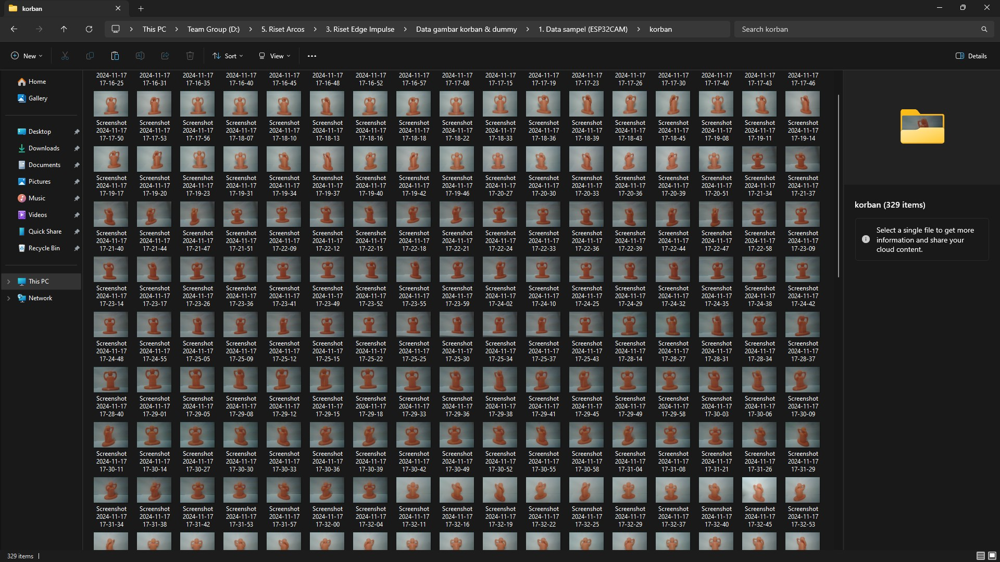
    - Pastikan dataset memiliki resolusi 320 x 240, karena ESP32-CAM bekerja dengan resolusi tersebut saat pendeteksian objek.
      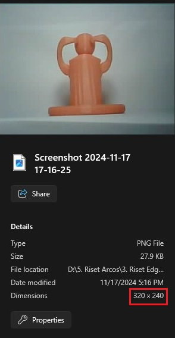
      
2. **Dashboard:**
    - Pastikan sudah daftar dan login ke Edge Impulse.
    - Buat proyek baru dan pilih Add existing data di halaman Dashboard.
      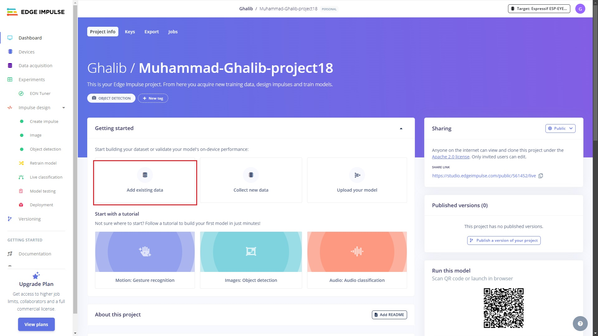
    - Pilih Upload Data dan pilih choose file dataset anda.
      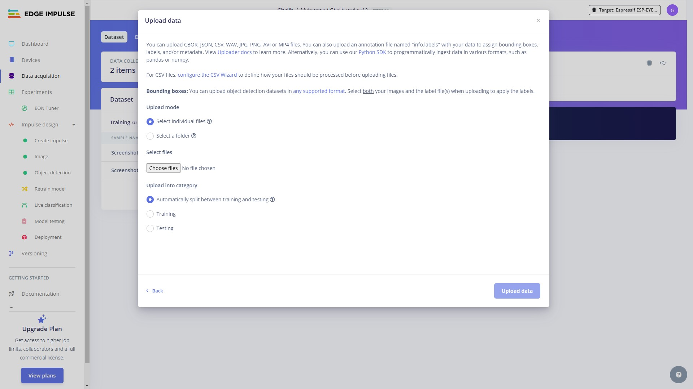
      
3. **Data acquisition:**
    - Pilih Labeling Queue.
      
    - Tandai objek pada gambar dan beri label sesuai keinginan, kemudian simpan label tersebut.
      
5. **Create Impulse:**
    - Jika muncul Configure your target device and application budget, pilih Espressif ESP-EYE (ESP32 240MHZ) lalu save.
      
    - Pilih Image pada Add a processing block.
      
    - Pilih Object Detection (images) pada Add a learning block dan simpan impulse.
      
      
7. **Image:**
    - Pilih Grayscale untuk color depth dan Save parameters.
      
    - Klik Generate Features, dan pastikan statusnya Job completed (success).
      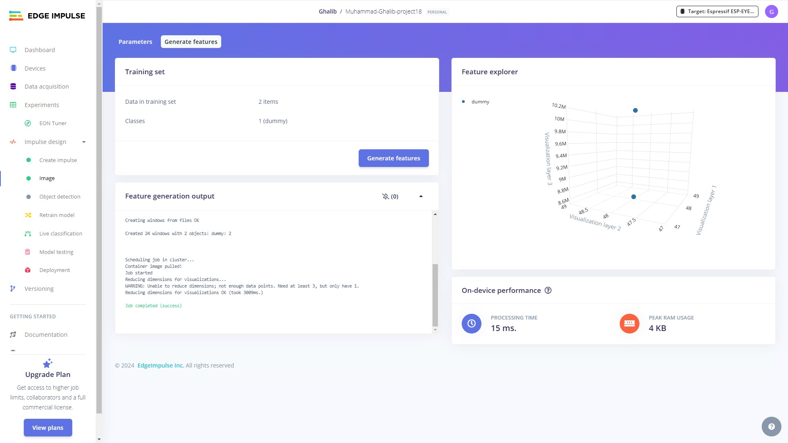
      
8. **Object Detection:**
    - Atur Number of training cycles ke 60, Atur Learning rate ke 0.005, Pilih model FOMO MobileNetV2 0.35. Kemudian klik Save & Train.
      
    - Pastikan statusnya Job completed (success).
      
9. **Deployment:**
    - Pada Search deployment options pilih Arduino library. Lalu klik Build.
      

2️⃣ **Pengunggahan ke ESP32-CAM**
Pengunggahan ke **ESP32-CAM** mencakup beberapa komponen penting berikut ini:
1. **Menambahkan Library**
    - Download library dari hasil build di Edge Impulse.  
      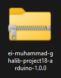  
    - Di Arduino IDE (v1.8.19), pilih Sketch > Include Library > Add .ZIP Library, lalu tambahkan file ZIP yang sudah di-download.
      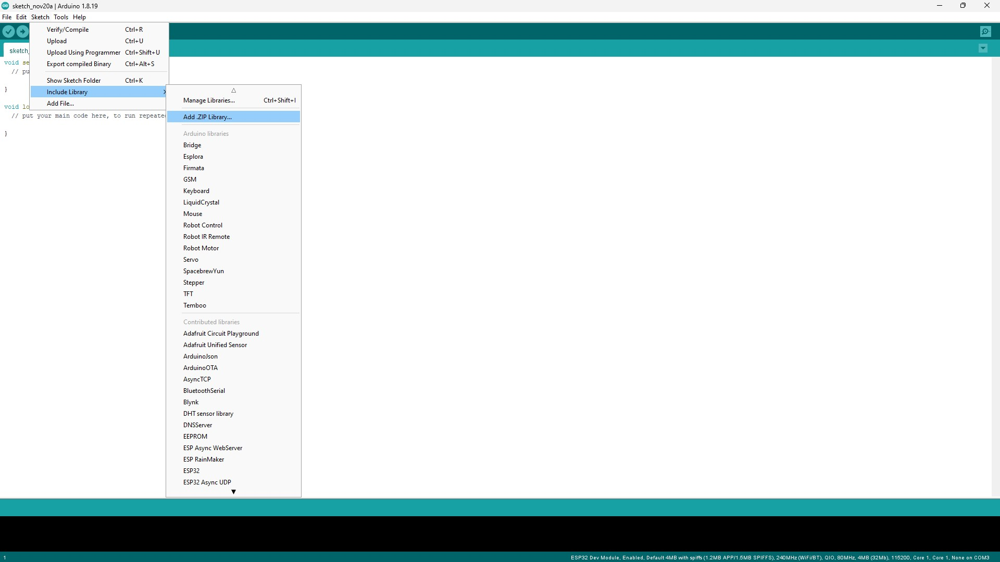

3. **Akses kode**
    - Buka File > Examples > (Nama Library) > esp32 > esp32_camera.
      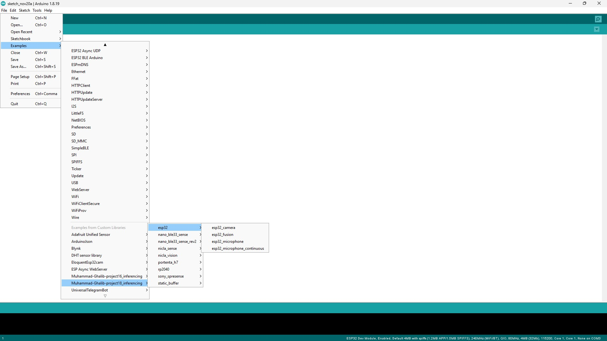
    - Jika menggunakan kamera AI Thinker, Uncomment baris #define CAMERA_MODEL_AI_THINKER.
      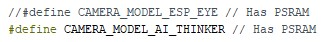

5. **Upload**
    - Atur konfigurasi upload di Tools seperti digambar bawah ini, lalu klik Upload.
      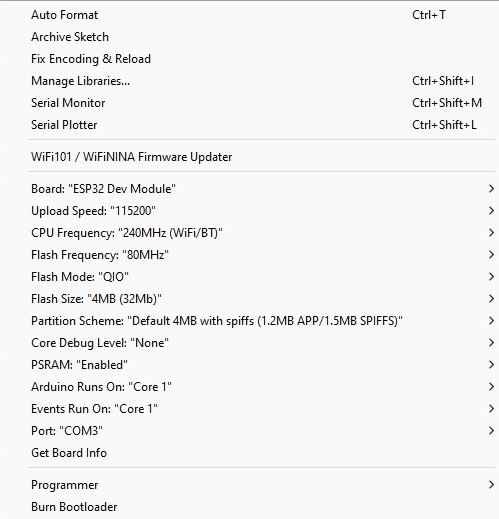

3️⃣ **Uji dan Implementasi**
1. **Uji Deteksi Objek**
    - Arahkan **ESP32-CAM** ke arah objek
      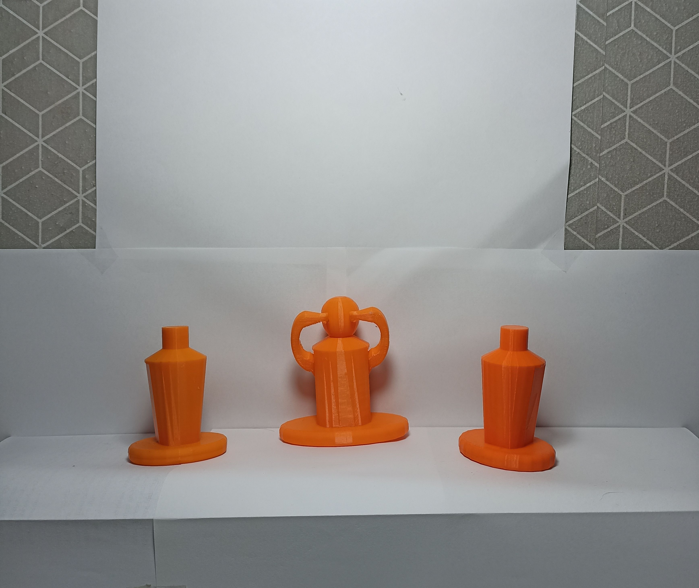
    - Cek hasilnya di Serial Monitor.
      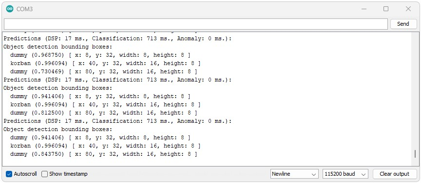

## 📊 **Fitur Ekstra: Visualisasi Posisi Objek**
Fitur ini menampilkan posisi objek yang terdeteksi secara real-time dalam grafik 2D, dengan warna berbeda untuk tiap objek. Memudahkan pemantauan posisi objek secara langsung, dibandingkan harus melihat data di serial monitor.

1️⃣ **Cara Kerja Fitur**  
Fitur ini menerima data objek terdeteksi dari ESP32-CAM melalui port serial. Program Python memproses data tersebut, mengekstrak koordinat objek, dan menggambar posisi objek dalam grafik. Grafik ini diperbarui setiap kali data baru diterima dari perangkat.

2️⃣ **Panduan Penggunaan Fitur**  
1. Install Python dan Library
    - Pastikan Python dan library matplotlib terpasang di komputer Anda. Install dengan perintah:
      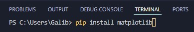  
    - Sambungkan **ESP32-CAM** ke komputer melalui kabel USB dan pastikan port serial yang digunakan sudah benar.  
    - Jalankan program Python yang sudah disediakan untuk memulai visualisasi posisi objek yang terdeteksi.  
      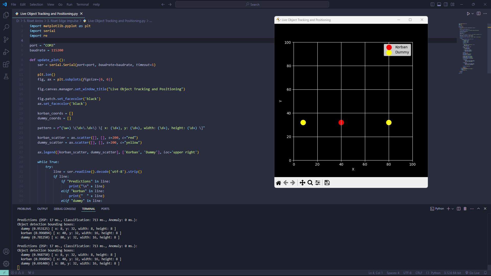

## 🔗 **Referensi**
1. [Edge Impulse for Arduino Library](https://docs.edgeimpulse.com/docs/run-inference/arduino-library)
    - Dokumentasi ini menjelaskan langkah-langkah untuk mengintegrasikan model machine learning yang dilatih di Edge Impulse dengan perangkat berbasis Arduino, seperti ESP32. Dengan menggunakan Edge Impulse Arduino Library.
2. [Youtube Video Tutorial from DroneBot Workshop](https://www.youtube.com/watch?v=HDRvZ_BYd08&list=WL&index=6&t=1731s)
    - Video ini memberikan panduan langkah-demi-langkah, termasuk pengumpulan data, pelatihan model, dan penerapan inferensi di perangkat keras seperti ESP32.
